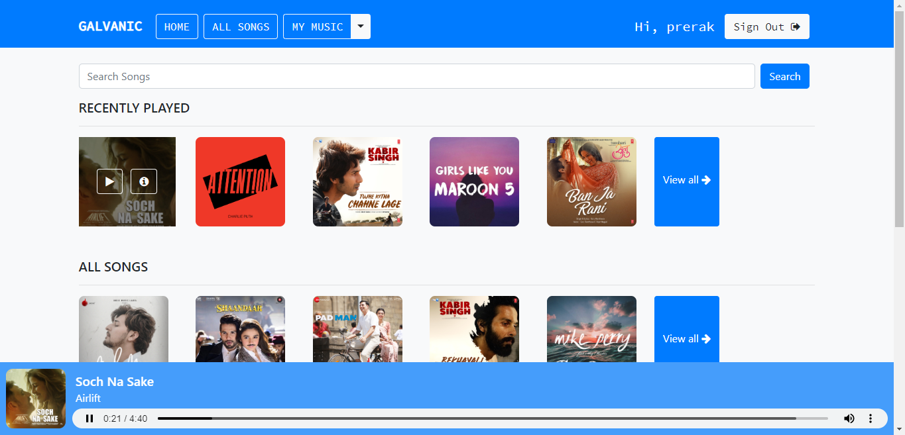

# Django based music streaming website
> https://galvanic-music.herokuapp.com/

 
[](https://github.com/rajaprerak/MusicPlayer/commits/master)
[](https://galvanic-music.herokuapp.com/)
[](http://badges.mit-license.org)

### Website Preview
#### Home Page


#### Detail Page


----

## Installation 📦

>pip install -r requirements.txt

#### Clone

- Clone this repo to your local machine.

#### Run server locally

```shell
$ python manage.py runserver
```
> Go to localhost:8000

---

## Features 📋
⚡️ SignUp and SignIn option.\
⚡️ Google SignUp and SignIn option.\
⚡️ Play song, view detailed information of song.\
⚡️ Search songs.\
⚡️ Filter songs based on language and singer.\
⚡️ Create new playlist.\
⚡️ Add/Remove songs to/from playlist.\
⚡️ Add/Remove songs to/from favourites.\
⚡️ Scroll through recently played/viewed songs.\
⚡️ Explore songs through your personalized playlist and favourites.


---

## Contributing 💡


#### Step 1

- **Option 1**
    - 🍴 Fork this repo!

- **Option 2**
    - 👯 Clone this repo to your local machine.


#### Step 2

- **Build your code** 🔨🔨🔨

#### Step 3

- 🔃 Create a new pull request.


## Team ✨

| <a href="https://rajaprerak.github.io" target="_blank">**Prerak Raja**</a> | <a href="https://varadbhogayata.github.io" target="_blank">**Varad Bhogayata**</a> | 
| :---: |:---:|
| [](https://rajaprerak.github.io)    | [](https://varadbhogayata.github.io) ||
| <a href="https://github.com/rajaprerak" target="_blank">`github.com/rajaprerak`</a> | <a href="https://github.com/varadbhogayata" target="_blank">`github.com/varadbhogayata`</a> 


## License
[](http://badges.mit-license.org)

- **[MIT license](http://opensource.org/licenses/mit-license.php)**
